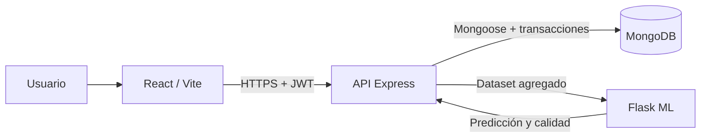

# Arquitectura

SIST-CLINICA separa presentación, reglas clínicas y predicción estadística.

## Responsabilidades

- **Frontend:** navegación por roles, formularios y visualización. No decide permisos.
- **API:** autenticación, autorización, validación, concurrencia, transacciones y auditoría.
- **MongoDB:** persistencia e índices únicos para la integridad bajo concurrencia.
- **ML:** limpieza, validación temporal, selección de modelo e intervalos predictivos.

## Flujos críticos

### Autenticación

El backend firma JWT HS256 con sujeto, rol, emisor, audiencia y expiración. Cada petición protegida vuelve a consultar el usuario y rechaza cuentas inactivas, roles modificados o tokens anteriores al cambio de contraseña.

### Citas

Cada cita activa almacena los minutos ocupados. Índices únicos impiden simultáneamente solapamientos del odontólogo y del paciente. Cancelar o atender libera esos minutos.

### Atención clínica

La creación de expediente, descuento condicional de stock, registro de consumos y cierre de cita se ejecutan en una transacción MongoDB. MongoDB debe soportar transacciones.

### Predicción

La API extrae consumos válidos y ML completa la serie mensual, limita outliers para entrenamiento, ejecuta backtesting y selecciona regresión lineal o último valor.
